<div align="center">

# mac-tui-procmon

### The process monitor that answers back.

**An AI-augmented terminal UI process monitor for macOS. Every screen — process tree, forensic inspect, network panel, live security timeline — is one keystroke away from a context-grounded conversation with the assistant of your choice. Built on direct `libproc` / `sysctl` calls so it stays up while the host falls apart.**

[](LICENSE)


</div>

<p align="center">
  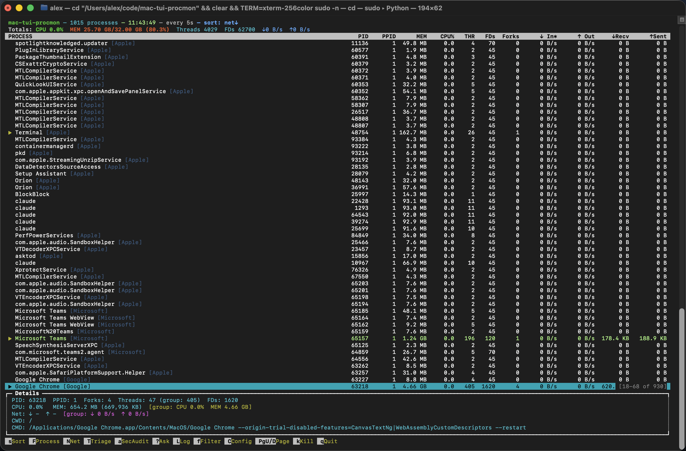
</p>

## Why it's different

- **🧠 Ask the screen.** Press `?` from anywhere — process list, inspect view, network panel, security timeline — and an LLM answers *"what is this thing? is it suspicious? what's it doing on port 443?"* grounded in the exact context you're looking at, not generic advice.
- **🤝 Three-model consensus on every Inspect.** The forensic Inspect path doesn't just show codesign + YARA + binary trust — it runs **Claude, Codex, and Gemini in parallel** against the same evidence and synthesizes a `CONSENSUS_RISK` / `AGREEMENT` / `DIVERGENT` / `FINAL RECOMMENDATION` report. One model flagging a binary is suggestive; three converging is hard to dismiss.
- **🔁 Smart fallback chain.** The Ask overlay tries `claude` first, auto-falls-back to `codex` then `gemini` on timeout or error. The prompt's status line reflects which assistant is currently working — `[claude thinking…]` → `[trying with codex…]` → `[trying with gemini…]`.
- **🛡 Zero-stall under sudo.** When you run as root for memory-region YARA or `eslogger`, every assistant subprocess is wrapped to drop back to your real UID — so the local keychain still works and `claude` doesn't hang on auth.
- **⚡ Resilient core.** Direct `libproc` / `sysctl` snapshots, no `fork()` per refresh. Survives fork bombs and memory exhaustion that knock `htop` and Activity Monitor offline.
- **📜 LLM-summarized event streams.** Watch a live Endpoint Security stream, hit `Esc` once, and the captured exec / auth / TCC / XProtect events come back as an executive summary before the panel closes.

> [!NOTE]
> **Process-monitoring only.** Host-wide security posture — TCC, kernel/boot, persistence, browser extensions, CVE intelligence, full security scoring, remediation workflows, headless audit reports — lives in the sister project [`mac-system-security`](https://github.com/alex-iliadis/mac-system-security).

---

## Table of Contents

- [Quick Start](#quick-start)
- [Process View](#process-view)
  - [Vendor Grouping](#vendor-grouping)
  - [Process Group View](#process-group-view)
  - [Sort Dialog](#sort-dialog)
  - [Sorting](#sorting)
  - [Dynamic Sort](#dynamic-sort)
  - [Filtering](#filtering)
- [Process Investigation](#process-investigation)
  - [Inspect](#inspect)
  - [Deep Process Triage](#deep-process-triage)
  - [Network Connections](#network-connections)
- [Live Telemetry](#live-telemetry)
  - [Endpoint Security Stream](#endpoint-security-stream)
  - [Traffic Inspector](#traffic-inspector)
- [Ask Claude](#ask-claude)
- [Debug Log](#debug-log)
- [Alerts & Configuration](#alerts--configuration)
- [Sudo Wrapper](#sudo-wrapper)
- [Keybindings](#keybindings)
- [CLI Reference](#cli-reference)
- [Environment Variables](#environment-variables)
- [Platform & Requirements](#platform--requirements)
- [Testing](#testing)
- [Wiki](#wiki)

---

## Quick Start

```bash
python3 mac_tui_procmon.py                 # all processes
python3 mac_tui_procmon.py firefox -i 2    # filter on "firefox", refresh 2s

# Full capabilities (memory-region YARA, eslogger, hidden-process kqueue):
sudo -n /usr/local/sbin/mac-tui-procmon-sudo --skip-preflight
```

`procmon.py` remains as a compatibility shim.

On first launch, the preflight checks only the dependencies the
process monitor itself needs. Optional integrations (`eslogger`,
`mitmdump`, `osquery`, `yara`, the LLM CLIs) are detected at startup
but never block the TUI.

---

## Process View

The default view is a real-time process tree with aggregated stats
across each subtree: CPU, memory, threads, file descriptors, fork
count, and inbound/outbound network rates.


Columns: `PID`, `PPID`, `MEM`, `CPU%`, `THR`, `FDs`, `Forks`, `↓In`,
`↑Out`, `↓Recv`, `↑Sent`. Individual metric cells turn **red** when
they exceed their alert threshold and **yellow** at 80% — only the
specific cell is highlighted, not the whole row, so you can spot
exactly which dimension blew out.

### Vendor Grouping

Press `g` (or toggle from the Sort dialog) to group processes by
code-sign vendor at the top level: Apple, Google, Microsoft, Signal,
etc. Vendor is detected from bundle path prefixes and reverse-DNS
identifier heuristics.

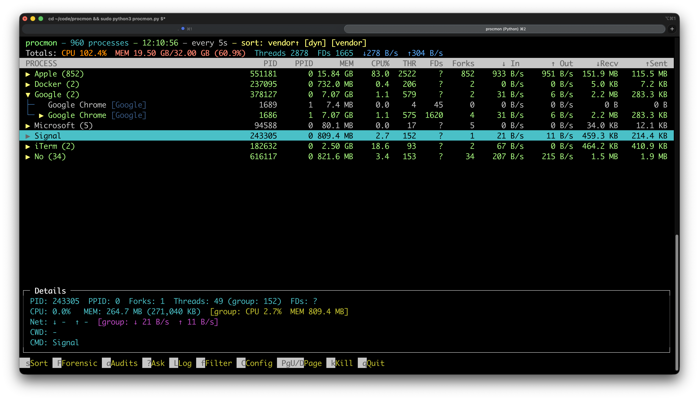

Sibling processes with the same name automatically collapse into a
single row showing the member count
(e.g. `Google Chrome Helper (Renderer) [Google] (16)`).

### Process Group View

The default tree groups children under their parent. `←` collapses,
`→` expands a subtree.

### Sort Dialog

Press `s` for a menu of every sort mode in case you can't remember
the hotkey.

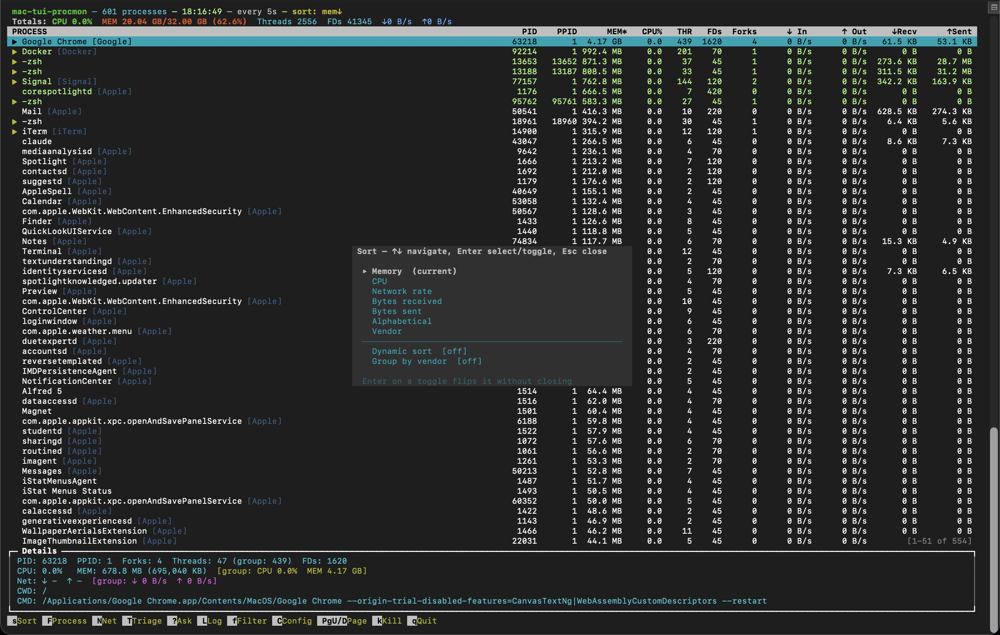

### Sorting

| Sort mode      | Key | Notes                                        |
|----------------|-----|----------------------------------------------|
| Memory         | `m` | RSS                                          |
| CPU            | `c` | %CPU since last refresh                      |
| Network rate   | `n` | in + out, bytes/sec                          |
| Bytes received | `R` | cumulative                                   |
| Bytes sent     | `O` | cumulative                                   |
| Alphabetical   | `A` | by command                                   |
| Vendor         | `V` | by code-sign team                            |

Pressing the same sort key twice inverts direction.

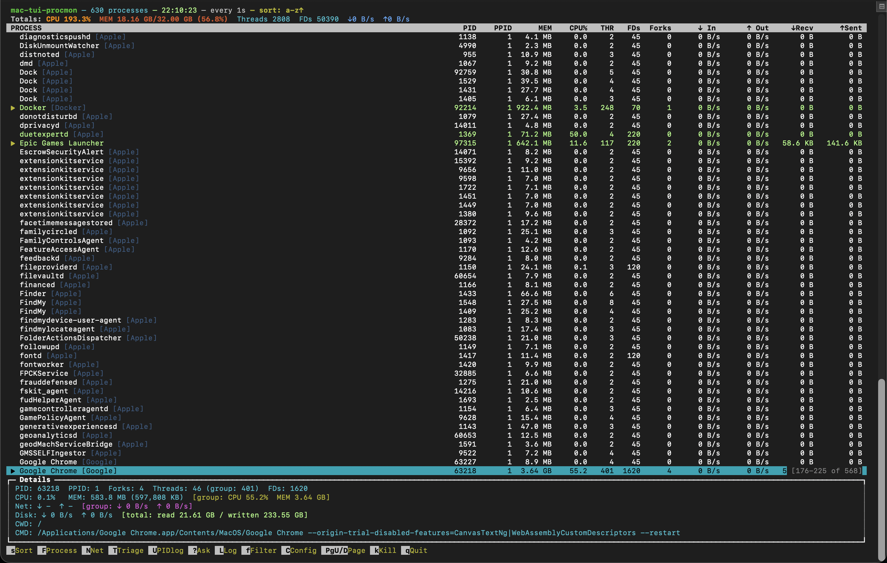

### Dynamic Sort

`d` toggles **dynamic sort**: any process exceeding *any* alert
threshold floats above the rest, with the active sort as secondary
ordering inside each group. The header shows `[dyn]` while it's on.

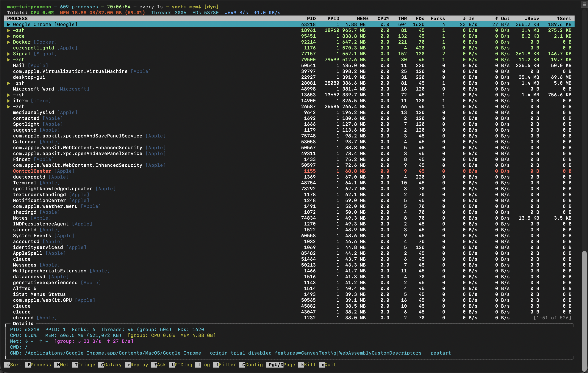

### Filtering

Press `f` to set comma-separated include and/or exclude patterns.
Substring match, case-insensitive. Combine both fields to narrow
quickly to whatever you care about right now.

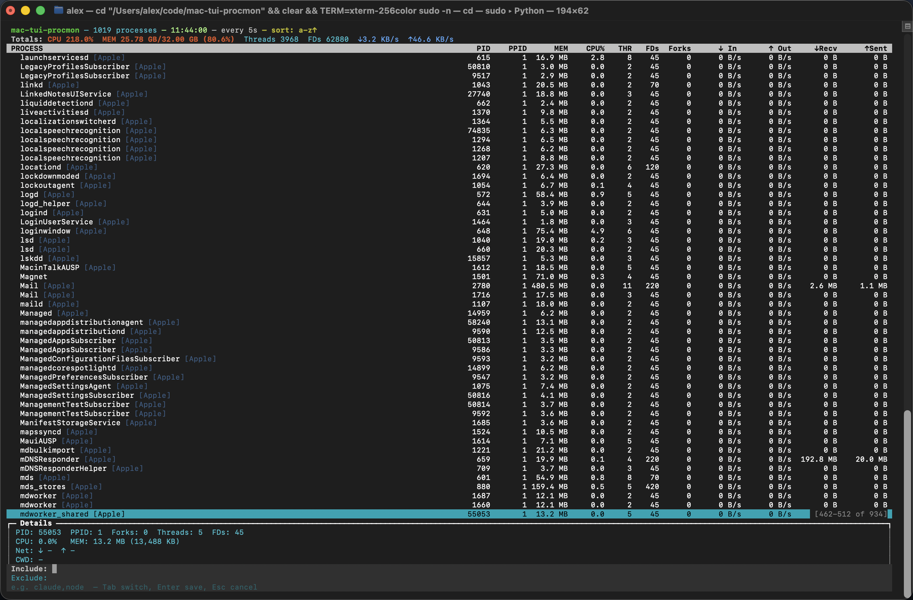

---

## Process Investigation

Press `F` to open the Process Investigation menu — every action is
scoped to the currently selected process.

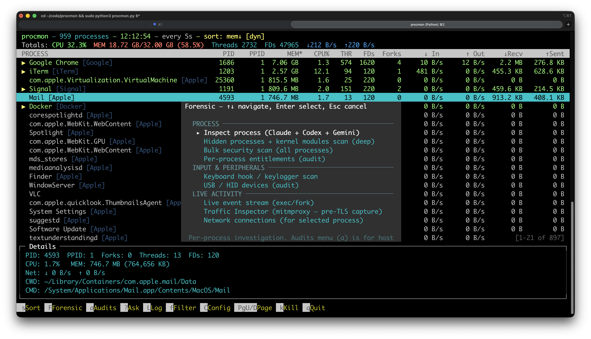

| Option                         | What it does                                                                                                              |
|--------------------------------|---------------------------------------------------------------------------------------------------------------------------|
| **Inspect process**            | Full forensic artifact bundle for the selected PID, then a parallel Claude + Codex + Gemini consensus report              |
| **Deep process triage**        | Cross-correlates inspect artifacts with osquery, injection / anti-debug evidence, persistence telemetry, and network state |
| **Network connections**        | Per-connection list with GeoIP, org, byte counters, and one-key kill                                                      |

### Inspect

Press `I` (or pick "Inspect process" in the menu). Gathers code-sign
metadata, Gatekeeper assessment, Apple-signed inference,
entitlements, dylibs, SHA-256, on-disk YARA matches, and — when
running as root — YARA on a memory snapshot of the live process.
Top-of-report badges (`[MEMORY-DUMPED]`, `[MEMORY-SKIPPED]`,
`[DISK-YARA]`) tell you at a glance which scans actually ran.

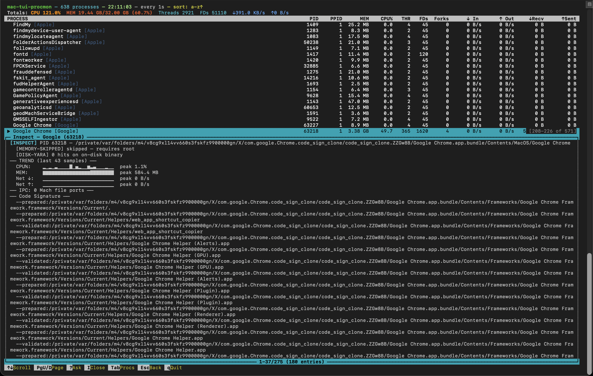

The same view shows entitlement abuse signals when present — for
example, dangerous combos on a non-Apple binary or runtime paths
under user-writable trees.

### Deep Process Triage

`T` runs a deeper triage pass: inspect artifacts plus an osquery
process-table snapshot, injection / anti-debug evidence
(`_audit_injection_antidebug_pid`), binary-trust profile, and a
structured cursor over the resulting findings. Each finding has a
severity, a one-line message, evidence, and (when applicable) an
action payload.

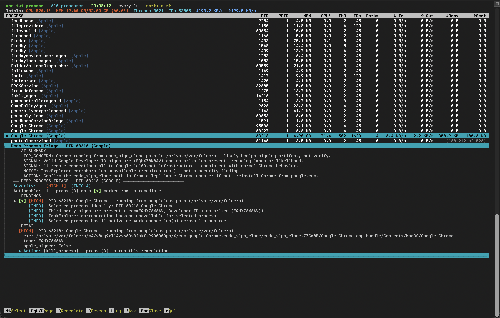

`R` re-runs the triage; `Up`/`Down` walks the cursor; `Esc` closes.

### Network Connections

Press `N` (or pick "Network connections"). Surfaces every TCP/UDP
endpoint owned by the selected process via `lsof`/`nettop`, with:

- Protocol and service name (HTTPS, DNS, SSH, …)
- Destination + reverse-DNS hostname
- GeoIP city / country and abbreviated org tag (`[AWS]`,
  `[Cloudflare]`, …)
- Per-flow cumulative bytes in/out

Press `k` on a highlighted row to kill **just that connection**
without killing the process. Press `N` again or `Esc` to close.

---

## Live Telemetry

Press `E` to open the telemetry menu.

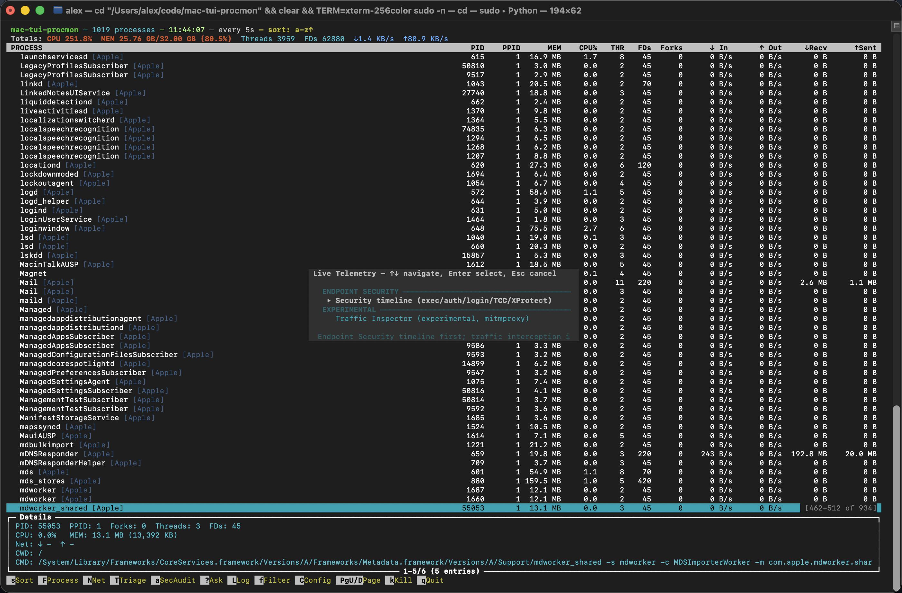

| Option                          | What it does                                                                                                            |
|---------------------------------|-------------------------------------------------------------------------------------------------------------------------|
| **Security timeline**           | `eslogger` exec / auth / login / TCC / XProtect / launch-item events, scoped to processes you care about                |
| **Traffic Inspector** (experimental) | `mitmdump` proxy wrapper for app-scoped decrypted traffic when you deliberately route a suspect app through 127.0.0.1:8080 |

### Endpoint Security Stream

Set `MAC_TUI_PROCMON_ES_SELECT_PREFIXES` before launch to scope the
feed:

```bash
MAC_TUI_PROCMON_ES_SELECT_PREFIXES=/usr/sbin/sshd:/usr/bin/sudo \
    sudo -n /usr/local/sbin/mac-tui-procmon-sudo
```

The active scope shows in the timeline header.

`c` clears the buffer. **First Esc** stops the stream and triggers
an LLM summary of everything captured. **Second Esc** closes the
view. The shortcut bar updates between the two stages so the flow
is explicit.

### Traffic Inspector

Experimental. Spins up a `mitmdump` shim on a local port (default
`127.0.0.1:8080`) and surfaces flows attributable to the selected
process. `c` clears flows; `Esc` stops the shim and closes.

---

## Ask Claude

Press `?` from anywhere — main list, inspect, triage, network view,
live events, log overlay, anywhere. The overlay captures the
current screen as the system prompt, asks the assistant an
immediate "Tell me more about this item." question, then stays
open for multi-turn follow-ups.

The embedded session can inspect the host directly: read files, run
investigation commands, verify a binary signature, walk a path
shown in the detail pane. That makes it useful for:

- asking what an extension, LaunchAgent, binary, entitlement, or
  network connection actually is
- pivoting from a finding into deeper host investigation without
  leaving the TUI
- following up to narrow in on benign vs. expected vs. suspicious

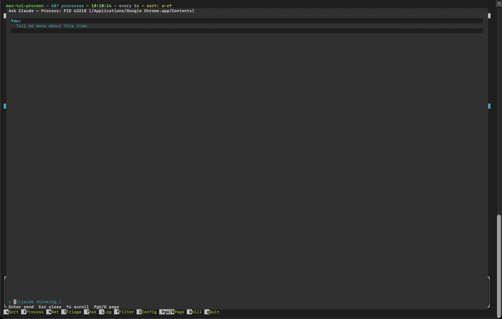

> [!TIP]
> **Fallback chain.** The overlay tries `claude` first; on timeout or failure it auto-falls-back to `codex`, then `gemini`. The status line in the prompt updates as the chain advances (`[claude thinking…]` → `[trying with codex…]` → `[trying with gemini…]`) so you always know which assistant is working. Per-CLI timeout is 60s (override via `MAC_TUI_PROCMON_CHAT_TIMEOUT`).

> [!WARNING]
> **De-elevation under sudo.** When procmon runs as root, each assistant subprocess is wrapped with `sudo -n -E -u $SUDO_USER --` so the CLI executes as the invoking user. This is required for `claude`, whose OAuth/keychain reads gate on process UID — running it as root makes it hang on auth.

Inspect runs Claude + Codex + Gemini in parallel and synthesizes a
consensus report (`CONSENSUS_RISK`, `AGREEMENT`,
`COMMON FINDINGS`, `DIVERGENT`, `FINAL RECOMMENDATION`).

---

## Debug Log

Press `L` from anywhere to open the in-TUI debug log. Scrollable,
capped at 500 lines, written to by every internal subsystem
(preflight, traffic shim, inspect worker, kill dispatcher, …).

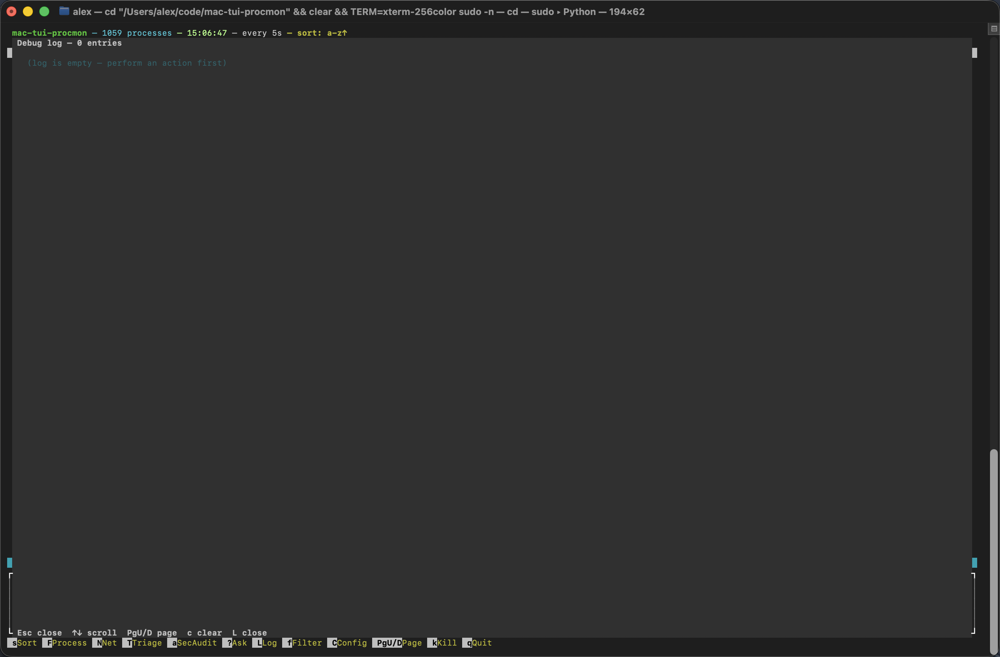

`c` clears. `L`, `Esc`, or `q` closes.

---

## Alerts & Configuration

Press `Shift+C` to set system-wide alert thresholds. Settings
persist to `~/.mac-tui-procmon.json`.

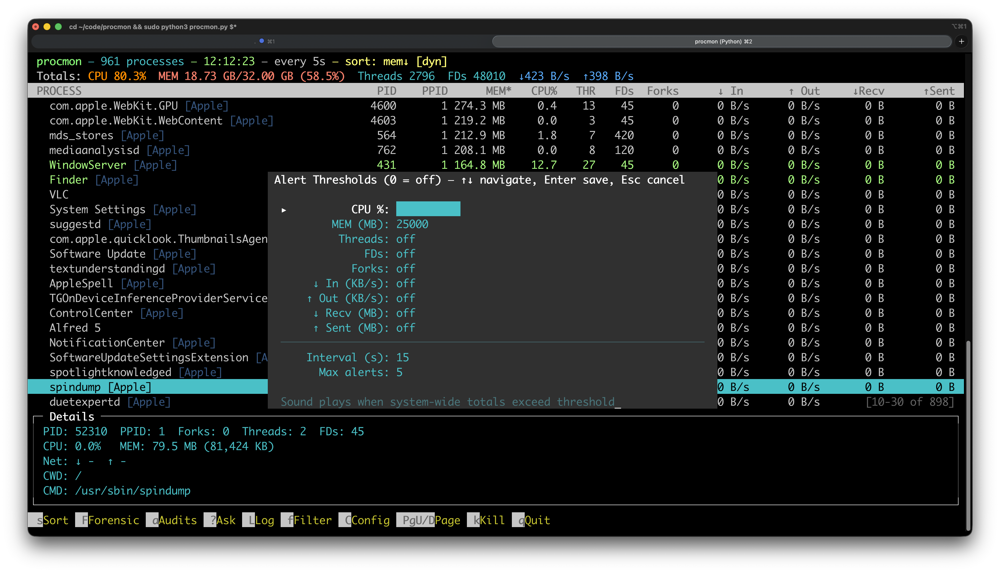

| Setting                | Description                                              |
|------------------------|----------------------------------------------------------|
| CPU %                  | System-wide CPU usage threshold                          |
| MEM (MB)               | System-wide memory threshold                             |
| Threads                | Total thread count threshold                             |
| FDs                    | Total file descriptor threshold                          |
| Forks                  | Total fork count threshold                               |
| In/Out (KB/s)          | Network rate thresholds                                  |
| Recv/Sent (MB)         | Cumulative network byte thresholds                       |
| Interval (s)           | Seconds between repeated alerts (default: 60)            |
| Max alerts             | Cap on alert sounds (0 = unlimited, default: 5)          |

The alert counter resets only after every value stays below
threshold for a full interval — that keeps an oscillating value
from re-arming the audible alert forever.

Dynamic sort (`d`) uses these same thresholds: anything currently
exceeding floats above everything else.

---

## Sudo Wrapper

> [!IMPORTANT]
> Some features need root — memory-region YARA inside Inspect and `eslogger` for the Endpoint Security stream. The wrapper at `scripts/mac-tui-procmon-sudo` is the canonical privileged entry point. It preserves the caller's `PATH` and `HOME` so user-installed CLIs (`eslogger`, `osquery`, `mitmdump`, `yara`, `codesign-checker`, …) resolve under sudo the same way they do without it.

Install once:

```bash
sudo scripts/install-sudo-wrapper.sh
```

This:

1. Installs `scripts/mac-tui-procmon-sudo` to `/usr/local/sbin/mac-tui-procmon-sudo` (root:wheel, mode 0755).
2. Drops `/etc/sudoers.d/mac-tui-procmon` after a `visudo -c` syntax check.

After install:

```bash
sudo -n /usr/local/sbin/mac-tui-procmon-sudo --help
sudo -n /usr/local/sbin/mac-tui-procmon-sudo
```

The sudoers entry is:

```
youruser ALL=(root) NOPASSWD: /usr/local/sbin/mac-tui-procmon-sudo *
```

---

## Keybindings

### Process list

| Key             | Action                                                |
|-----------------|-------------------------------------------------------|
| `↑` / `↓`       | Move selection                                        |
| `←` / `→`       | Collapse / expand subtree                             |
| `PgUp` / `PgDn` | Page                                                  |
| `m` `c` `n` `A` `V` `R` `O` | Sort modes (same key twice inverts)        |
| `d`             | Toggle dynamic sort                                   |
| `g`             | Toggle vendor grouping                                |
| `s`             | Sort dialog                                           |
| `f`             | Filter dialog                                         |
| `F`             | Process Investigation menu                            |
| `E`             | Live Telemetry menu                                   |
| `N`             | Toggle Network mode for selected process              |
| `I`             | Toggle Inspect mode                                   |
| `T`             | Toggle Deep Process Triage                            |
| `Shift+C`       | Alert config dialog                                   |
| `k`             | Kill selected process (`SIGTERM`)                     |
| `L`             | Toggle debug log overlay                              |
| `?`             | Toggle Ask Claude overlay                             |
| `Tab`           | Enter detail focus (when a special mode is open)      |
| `Esc`           | Close current special mode (or quit if none open)     |
| `q`             | Quit                                                  |

### Detail focus (Inspect / Audit / Events / Traffic / Network)

| Key             | Action                       |
|-----------------|------------------------------|
| `↑` / `↓`       | Scroll / move cursor         |
| `PgUp` / `PgDn` | Page                         |
| `Tab`           | Release detail focus         |
| `Esc`           | Close this mode              |
| `q`             | Quit                         |

Mode-specific extras:

- **Inspect** — `I` toggles off.
- **Audit / Triage** — `R`/`r` re-run, structured cursor over findings.
- **Events** — `c` clears; first Esc stops + LLM summary, second Esc closes.
- **Traffic** — `c` clears flows; Esc/q stop the mitmdump shim.
- **Network** — `k` kills the highlighted connection; `N` closes.

### Chat overlay (`?`)

| Key                 | Action                       |
|---------------------|------------------------------|
| `Enter`             | Send                         |
| `↑` / `↓`           | Scroll history               |
| `Ctrl-U`            | Clear input                  |
| `Ctrl-A` / `Ctrl-E` | Jump to start / end of input |
| `Esc`               | Close                        |

### Log overlay (`L`)

| Key                  | Action          |
|----------------------|-----------------|
| `↑` / `↓`            | Scroll          |
| `PgUp` / `PgDn`      | Page            |
| `c`                  | Clear log       |
| `L` / `Esc` / `q`    | Close           |

---

## CLI Reference

```
python3 mac_tui_procmon.py [name] [-i SECONDS] [--no-fd] [--skip-preflight]
```

| Argument             | Description                                       |
|----------------------|---------------------------------------------------|
| `name`               | Process name filter (case-insensitive substring)  |
| `-i`, `--interval`   | Refresh interval in seconds (default: 5)          |
| `--no-fd`            | Skip FD counting for faster updates               |
| `--skip-preflight`   | Skip external-tool dependency check               |

That's the entire flag set. Host-wide auditing, baseline capture,
and full security scans are intentionally not here — they live in
[`mac-system-security`](https://github.com/alex-iliadis/mac-system-security):

```bash
python3 -m mac_system_security audit <name>
python3 -m mac_system_security full-scan --html --open-html
python3 -m mac_system_security capture-baseline
```

---

## Environment Variables

| Variable                                  | Effect                                        |
|-------------------------------------------|-----------------------------------------------|
| `MAC_TUI_PROCMON_CHAT_TIMEOUT`            | Chat-overlay LLM timeout (seconds)            |
| `MAC_TUI_PROCMON_TEST_MODE`               | Skip background workers (test fixtures)       |
| `MAC_TUI_PROCMON_CAPTURE_DIR`             | Directory for `*.screen.json` snapshots       |
| `MAC_TUI_PROCMON_CAPTURE_ACTION`          | Snapshot-file basename                        |
| `MAC_TUI_PROCMON_TEST_ACTION`             | Auto-trigger an action on TUI start           |
| `MAC_TUI_PROCMON_TEST_SELECT_PID`         | Auto-select this PID on start                 |
| `MAC_TUI_PROCMON_TEST_ALLOW_LLM`          | Allow real LLM CLIs in test mode              |
| `MAC_TUI_PROCMON_ES_SELECT_PREFIXES`      | Path-prefix filter for the Endpoint stream    |
| `MAC_TUI_PROCMON_INJECTION_PIDS`          | PIDs to scan for injection in triage          |
| `MAC_TUI_PROCMON_SUDO_NONINTERACTIVE`     | Skip sudo password prompts under `-n`         |

---

## Platform & Requirements

- **macOS only** — uses `libproc.dylib` and `libc.dylib` via ctypes
  for process enumeration without forking.
- **Python 3** — stdlib-only core; external integrations are
  detected at startup but never block.
- **Root recommended** for the memory-region YARA scan inside
  Inspect, the hidden-process kqueue diff, and the Endpoint
  Security stream.

External tools:

| Tool         | Feature                                                                | Install                                       |
|--------------|------------------------------------------------------------------------|-----------------------------------------------|
| `claude`     | AI in Inspect / Triage / Events / chat overlay                         | `npm install -g @anthropic-ai/claude-code`    |
| `codex`      | Parallel LLM in Inspect                                                | `npm install -g @openai/codex`                |
| `gemini`     | Parallel LLM in Inspect                                                | `npm install -g @google/gemini-cli`           |
| `yara`       | On-disk + memory signature scan inside Inspect                         | `brew install yara`                           |
| `mitmproxy`  | Experimental Traffic Inspector backend                                 | `brew install mitmproxy`                      |
| `osquery`    | Optional process-table corroboration in Triage                         | `brew install --cask osquery`                 |
| `eslogger`   | Endpoint Security timeline source                                      | preinstalled on macOS 12+                     |
| `lsof`       | Network connections                                                    | preinstalled                                  |
| `nettop`     | Per-flow byte counters                                                 | preinstalled                                  |
| `codesign` / `otool` / `shasum` / `vmmap` / `lldb` | Inspect artifacts             | `xcode-select --install`                      |

---

## Testing

```bash
# All tests
/opt/homebrew/bin/python3 -m pytest -q

# Honest coverage on the implementation module
/opt/homebrew/bin/python3 -m pytest -q \
    --cov=mac_tui_procmon_impl \
    --cov-report=term-missing
```

Local: **945 passed**, 75% coverage on `mac_tui_procmon_impl.py`
(5,770 statements). The 100% number on the public shim is an
artifact of measuring the re-export module — see
[Testing](docs/wiki/Testing.md) for the full breakdown.

---

## Wiki

- [Home](docs/wiki/Home.md)
- [Features](docs/wiki/Features.md)
- [Keybindings](docs/wiki/Keybindings.md)
- [Screens](docs/wiki/Screens.md)
- [Running](docs/wiki/Running.md)
- [Testing](docs/wiki/Testing.md)
- [Screenshots](docs/wiki/Screenshots.md)

---

## License

[GNU AGPL v3.0](LICENSE). Network-deployed modifications must publish
their source under the same terms.
