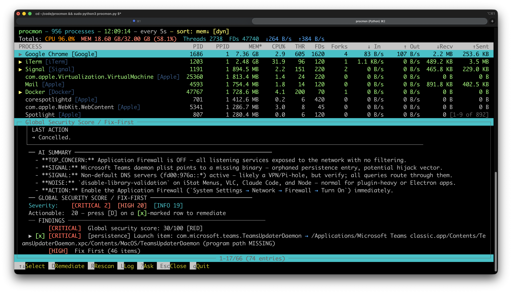
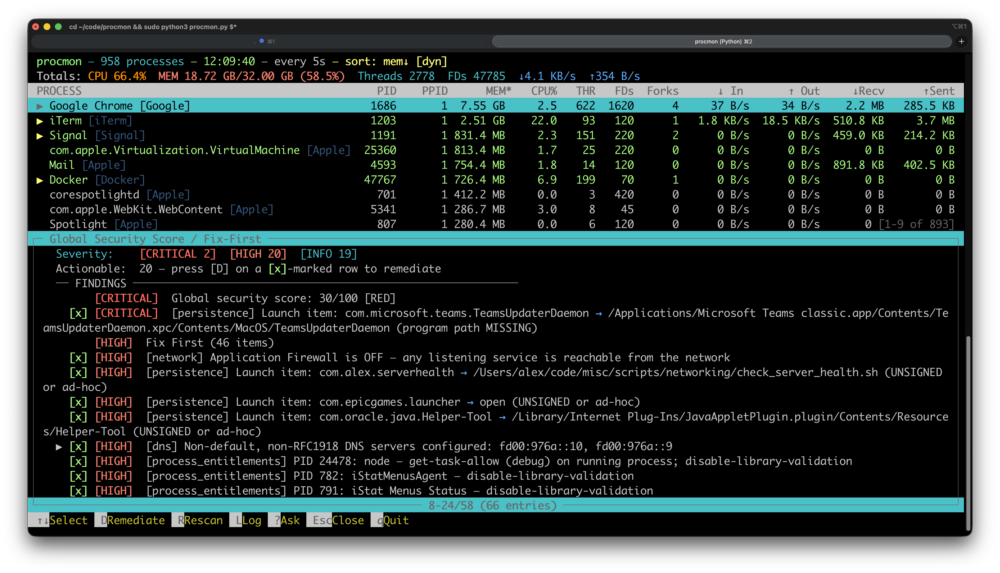
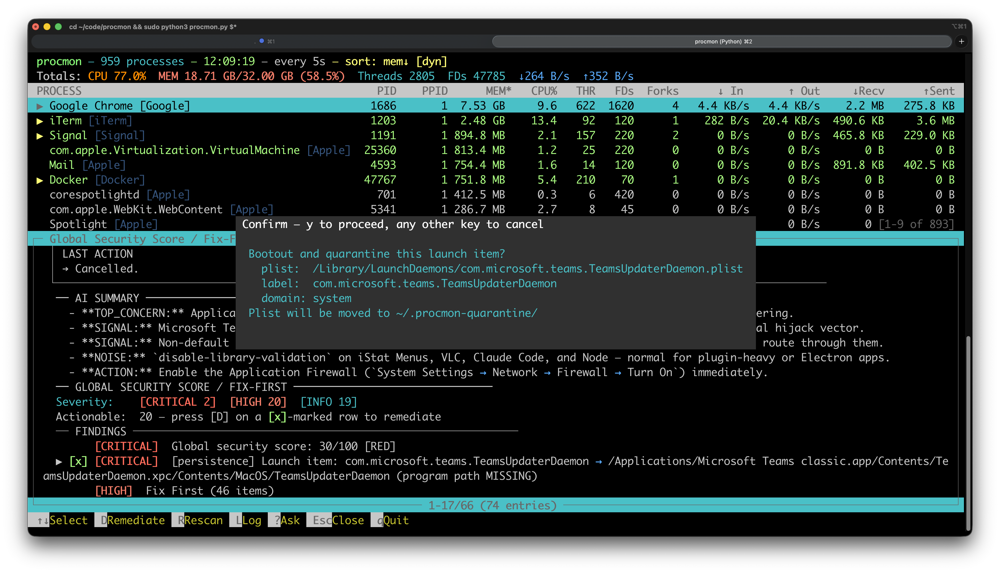
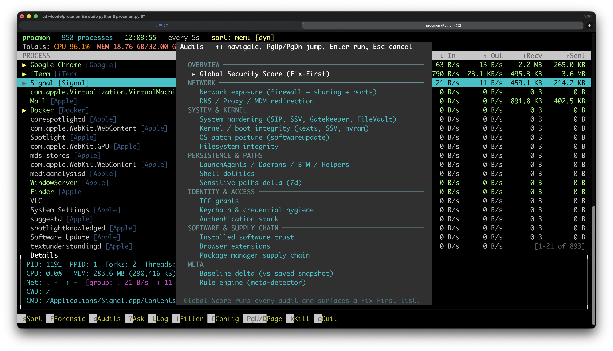
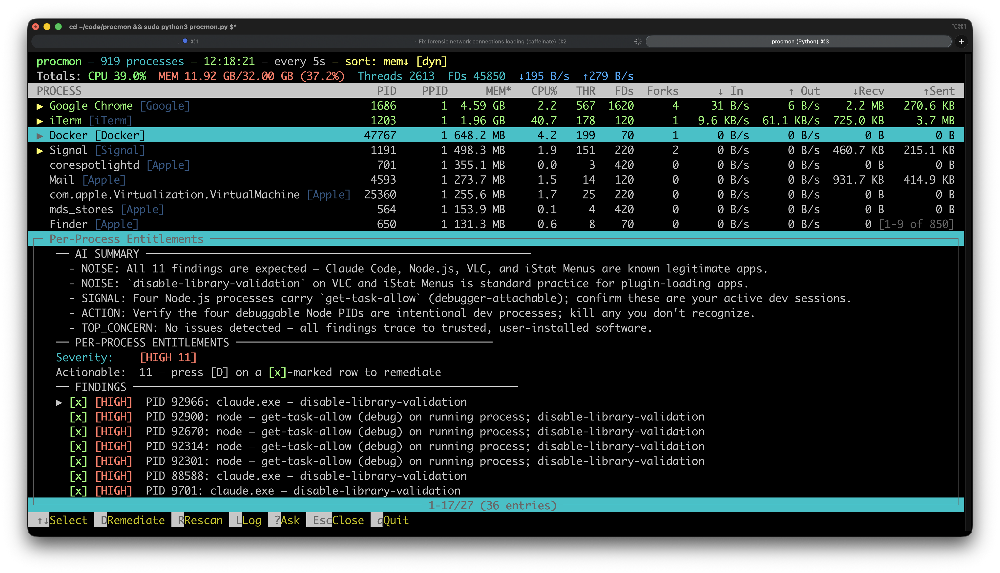
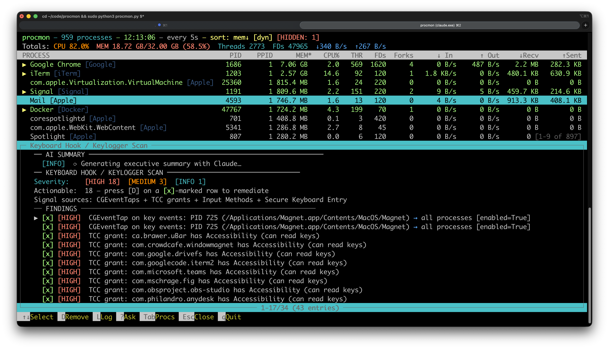
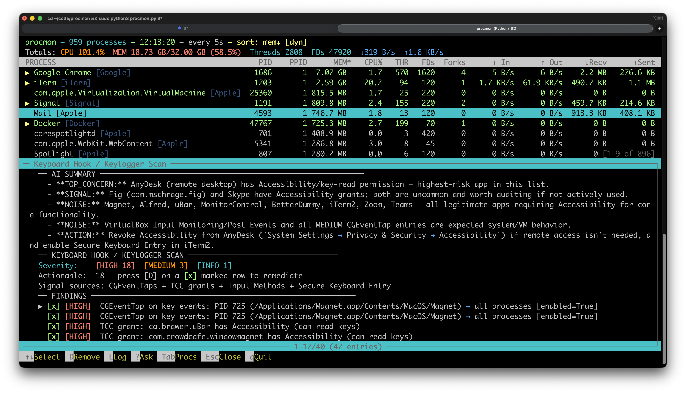
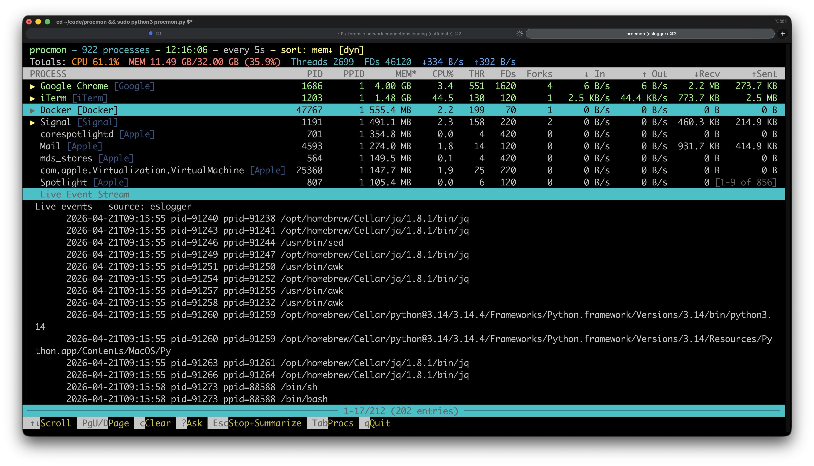
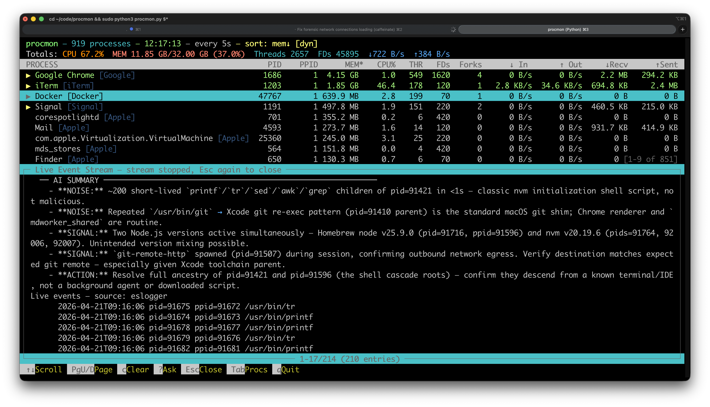

# procmon

> A real-time macOS process monitor, security auditor, and forensic investigation tool — single file, zero dependencies.

---

## Table of Contents

- [What is procmon?](#what-is-procmon)
- [Quick Start](#quick-start)
- [Feature Highlights](#feature-highlights)
  - [Global Security Score](#global-security-score)
  - [One-Press Remediation](#one-press-remediation)
  - [Security Audits](#security-audits)
  - [Forensic Investigation](#forensic-investigation)
  - [Keylogger & Hook Detection](#keylogger--hook-detection)
  - [Live Event Stream](#live-event-stream)
  - [AI-Powered Analysis](#ai-powered-analysis)
  - [Network Connections](#network-connections)
- [Process View](#process-view)
  - [Vendor Grouping](#vendor-grouping)
  - [Sorting](#sorting)
  - [Filtering](#filtering)
  - [Ask Claude](#ask-claude)
- [Alerts & Configuration](#alerts--configuration)
- [Audits Reference](#audits-reference)
- [Keybindings](#keybindings)
- [CLI Reference](#cli-reference)
- [Platform & Requirements](#platform--requirements)

---

## What is procmon?

procmon is a terminal-based macOS process monitor that goes beyond `top` or `htop`. It combines a live process tree with a comprehensive security audit engine: 20 host-level checks, per-process forensic inspection powered by Claude + Codex + Gemini, keylogger detection, live exec/fork event streaming, and one-press remediations for every actionable finding — all in a single Python file with no external dependencies.

---

## Quick Start

```bash
sudo python3 procmon.py          # full features (audits need root for some checks)
python3 procmon.py               # works without root, some checks degraded
python3 procmon.py firefox -i 2  # monitor Firefox, refresh every 2s
sudo python3 procmon.py --audit global_score   # headless score + fix-first list
```

On first launch, procmon checks for optional CLIs (`claude`, `codex`, `gemini`, `yara`, `mitmproxy`, etc.) and offers to install any that are missing. Pass `--skip-preflight` to bypass.

---

## Feature Highlights

### Global Security Score

Press `a` → **Global Security Score** to run all 20 security audits back-to-back and get a weighted 0–100 score (Network 25% / System 30% / Kernel 25% / Library 20%). The host is rated **GREEN** (≥85) / **YELLOW** (60–84) / **ORANGE** (40–59) / **RED** (<40).



The AI Summary panel auto-generates after the scan completes — surfacing the top concern, signal findings, noise to ignore, and a concrete action to take first. Every CRITICAL and HIGH finding with a safe fix appears in the **Fix-First** list below the score.



---

### One-Press Remediation

Findings marked `[x]` have a safe remediation wired up. Press `D` on any such finding to execute it — procmon shows exactly what it will run and asks for confirmation before touching anything.



Destructive actions (bootout plist, restore `/etc/hosts`) move the original to `~/.procmon-quarantine/<timestamp>-<name>` rather than deleting it, so recovery is a single `mv`.

---

### Security Audits

Press `a` to open the Audits menu. Every audit runs interactively in the TUI or headless via `--audit <name>`.



| Category | Audits |
|----------|--------|
| **Overview** | Global Security Score (Fix-First) |
| **Network** | Network exposure (firewall + ports + sharing), DNS / Proxy / MDM |
| **System & Kernel** | System hardening (SIP/SSV/Gatekeeper/FileVault), Kernel & boot integrity, OS patch posture, Filesystem integrity |
| **Persistence & Paths** | LaunchAgents / Daemons / BTM / Helpers, Shell dotfiles, Sensitive paths delta (7d) |
| **Identity & Access** | TCC grants, Keychain & credential hygiene, Authentication stack |
| **Software & Supply Chain** | Installed software trust, Browser extensions, Package manager supply chain |
| **Meta** | Baseline delta (vs saved snapshot), Rule engine (meta-detector) |

Every audit renders the same three-part layout: title bar with severity counts → findings list with `[x]` markers → detail pane showing evidence and remediation. Severity tags are color-coded: **red** CRITICAL / **orange** HIGH / **cyan** MEDIUM / green OK.

---

### Forensic Investigation

Press `F` to open the Forensic menu for per-process investigation.


| Option | What it does |
|--------|-------------|
| **Inspect process** | Full forensic artifact bundle (codesign, entitlements, dylibs, SHA-256, open files, env, lineage, vmmap) → parallel Claude + Codex + Gemini analysis → consensus report |
| **Hidden processes + kernel modules** | Cross-references `proc_listallpids()` vs `ps`, network-visible PIDs, PID brute-force, IOKit kext enumeration |
| **Bulk security scan** | Every running process through the full inspect pipeline; 5 processes in parallel, 3 LLMs per process |
| **Per-process entitlements** | Flags dangerous entitlement combinations across all running PIDs |
| **Live event stream** | `eslogger` exec/fork stream (falls back to dtrace/praudit) |
| **Traffic Inspector** | `mitmproxy` wrapper — pre-TLS flow capture |
| **Network connections** | Per-connection list with GeoIP, org, and byte counters |

**Per-Process Entitlements** identifies dangerous combinations like `cs.disable-library-validation` + `DYLD_INSERT_LIBRARIES` (CRITICAL) across all running processes without needing to inspect each one manually.



---

### Keylogger & Hook Detection

From the Forensic menu → **Keyboard hook / keylogger scan**. Detects every active keystroke interception path on the host:

- **CGEventTaps** — enumerates all active taps via CoreGraphics ctypes; flags any whose mask covers keyDown/keyUp
- **TCC grants** — Input Monitoring, Accessibility, and PostEvent grants from TCC.db; HIGH for every non-Apple bundle
- **Input Methods** — third-party bundles under `/Library/Input Methods/` with codesign verification
- **Secure Keyboard Entry** — current holder PID via HIToolbox + ioreg



The AI Summary synthesizes all findings and calls out the actual risk level, separating expected system daemons from genuine threats.



Press `D` on any `[x]`-marked finding to remove it — TCC grants, CGEventTap processes, or Input Method bundles — with a confirmation prompt before any action.

---

### Live Event Stream

From the Forensic menu → **Live event stream**. Tails `eslogger` (macOS 12+) for real-time exec and fork events, with automatic fallback to dtrace or praudit.



Press **Esc once** to stop the stream and trigger an AI analysis of everything captured — identifying malicious processes, benign system noise, and chains worth drilling into.



A second **Esc** closes the view. The shortcut bar updates between the two stages to make this flow explicit.

---

### AI-Powered Analysis

Every finding view — audits, keyscan, hidden-process scan, Inspect — fires a background Claude call as soon as the scan completes. Results render as a bordered **AI SUMMARY** panel at the top with typed bullets:

| Bullet | Meaning |
|--------|---------|
| `TOP_CONCERN:` | The single most important finding |
| `SIGNAL:` | Genuine risk worth acting on |
| `NOISE:` | Expected behavior, not a threat |
| `ACTION:` | Concrete next step |

The **Ask Claude** overlay (`?`) is available from any view. It captures the current context (process row, full report, scan findings) and streams it into a multi-turn conversation with Claude.


Process Inspect runs Claude + Codex + Gemini in parallel and synthesizes a consensus report (`CONSENSUS_RISK`, `AGREEMENT`, `COMMON FINDINGS`, `DIVERGENT`, `FINAL RECOMMENDATION`).

---

### Network Connections

From the Forensic menu → **Network connections** (or press `N`). Shows all connections for the selected process and its subtree via `lsof`, with:

- Protocol and service name (HTTPS, DNS, SSH, etc.)
- Destination with reverse-DNS hostname
- GeoIP city/country and abbreviated org (`[AWS]`, `[Cloudflare]`, etc.)
- Per-flow cumulative bytes in/out from `nettop`

Press `k` to kill the process owning a selected connection.

---

## Process View

The main view is a real-time process tree with aggregated stats across subtrees: CPU, memory, threads, FDs, forks, and network rates.


Columns: `PID`, `PPID`, `MEM`, `CPU%`, `THR`, `FDs`, `Forks`, `↓In`, `↑Out`, `↓Recv`, `↑Sent`.

Individual metric columns turn **red** when they exceed their configured threshold, **yellow** at 80% — only the specific metric is highlighted, not the whole row.

---

### Vendor Grouping

Press `g` (or toggle in the Sort dialog) to group all processes by vendor at the top level: Apple, Google, Microsoft, Signal, etc. Vendor is detected from bundle path prefixes and reverse-DNS names.


Child processes with the same name are automatically grouped into a collapsible sibling node showing the member count (e.g., `Google Chrome Helper (Renderer) [Google] (16)`).

---

### Sorting

Press `s` to open the Sort dialog.


| Sort mode | Key |
|-----------|-----|
| Memory | `m` |
| CPU | `c` |
| Network rate | `n` |
| Bytes received | `R` |
| Bytes sent | `O` |
| Alphabetical | `A` |
| Vendor | `V` |
| Dynamic (threshold-first) | `d` |

**Dynamic sort** (`d`) pins threshold-exceeding processes to the top, with the active sort as secondary ordering within each group.

---

### Filtering

Press `f` to filter by process name (include and/or exclude, comma-separated). Combine both fields to narrow down to exactly the processes you care about.


---

### Ask Claude

Press `?` from anywhere — main list, any audit view, inspect report, scan results, or network connections. The overlay captures the current context and opens a multi-turn conversation. Follow-up questions see the full conversation history.


---

## Alerts & Configuration

Press `C` to configure system-wide alert thresholds. Settings persist to `~/.procmon.json`.


| Setting | Description |
|---------|-------------|
| CPU % | System-wide CPU usage threshold |
| MEM (MB) | System-wide memory threshold |
| Threads | Total thread count threshold |
| FDs | Total file descriptor threshold |
| Forks | Total fork count threshold |
| In/Out (KB/s) | Network rate thresholds |
| Recv/Sent (MB) | Cumulative network byte thresholds |
| Interval (s) | Seconds between repeated alerts (default: 60) |
| Max alerts | Maximum alert sounds (0 = unlimited, default: 5) |

The alert counter resets only after values stay below threshold for a full interval, preventing infinite alerts from oscillating values.

---

## Audits Reference

All 20 audits are available both interactively (`a` key) and headless (`--audit <name>`).

| Name | Key | Description |
|------|-----|-------------|
| `global_score` | `G` | Runs all audits, computes 0–100 weighted score, Fix-First list |
| `network` | `W` | Firewall state, listening ports (w/ codesign), sharing services, pfctl |
| `dns` | `Y` | DNS resolvers, system proxy, `/etc/hosts`, per-domain overrides, config profiles |
| `persistence` | `P` | LaunchAgents/Daemons, BTM, crontabs, LoginHook; codesigns every program |
| `system_hardening` | `S` | SIP, SSV, Gatekeeper, FileVault, Secure Boot, MDM, Lockdown Mode |
| `kernel_boot` | — | Non-Apple kexts, system extensions, NVRAM boot-args, EFI integrity |
| `patch_posture` | — | macOS version vs. supported releases, pending softwareupdate |
| `tcc` | — | All TCC service grants; non-Apple grants actionable with `tccutil reset` |
| `browser_exts` | — | Safari, Chrome, Brave, Edge, Arc, Firefox extensions; flags risky permissions |
| `usb_hid` | — | IOKit USB/HID device enumeration; flags keyboard/mouse-like devices |
| `shell_dotfiles` | — | Audits shell RC files for `curl\|bash`, `eval`, base64-exec, PATH prepends |
| `installed_software` | — | Codesigns every `/Applications` bundle; flags unsigned/ad-hoc/translocated |
| `process_entitlements` | — | Dangerous entitlement combos across all running PIDs |
| `filesystem_integrity` | — | World-writable files, SUID binaries, AuthorizationDB weakening |
| `sensitive_paths_delta` | — | 7-day mtime timeline over `/etc`, LaunchAgents, Extensions, etc. |
| `keychain` | — | Keychain ownership/mode, FileVault trust chain, Secure Token holders |
| `auth_stack` | — | SecurityAgentPlugins codesign, AuthorizationDB rights, PAM config |
| `packages` | — | npm globals (lifecycle hooks), Homebrew, Python site-packages, Cargo |
| `baseline_delta` | — | Diffs against a snapshot from `--capture-baseline` |
| `rule_engine` | — | JSON rule files from `~/.procmon-rules.d/` (path_exists, file_mode, etc.) |

---

## Keybindings

### Process List

| Key | Action |
|-----|--------|
| `s` | Sort dialog |
| `F` | Forensic dialog (per-process investigation) |
| `a` | Audits dialog (host-level posture checks) |
| `G` | Global Security Score (runs all audits) |
| `?` | Ask Claude about the current view |
| `f` | Filter processes |
| `C` | Alert threshold configuration |
| `g` | Toggle vendor grouping |
| `d` | Toggle dynamic sort |
| `Left/Right` | Collapse / expand tree node |
| `PgUp/PgDn` | Page navigation |
| `k` | Kill selected process subtree |
| `q` | Quit |

### Audit / Forensic Views

| Key | Action |
|-----|--------|
| `Up/Down` | Move selection cursor |
| `D` / `d` | Remediate selected finding (with confirmation) |
| `R` / `r` | Rescan |
| `L` | Debug log (shows exact command + output) |
| `?` | Ask Claude about the current view |
| `Tab` | Toggle focus back to process list |
| `Esc` | Close view |

### Chat Overlay (`?`)

| Key | Action |
|-----|--------|
| `Enter` | Send question |
| `Up/Down` | Scroll conversation |
| `Ctrl-U` | Clear input |
| `Ctrl-A` / `Ctrl-E` | Jump to start / end of input |
| `Esc` | Close and return to previous view |

### Network View

| Key | Action |
|-----|--------|
| `Up/Down` | Select connection |
| `k` | Kill process owning selected connection |
| `N` | Close network view |
| `Tab` | Toggle focus between list and connections |

---

## CLI Reference

```
python3 procmon.py [name] [-i SECONDS] [--no-fd] [--skip-preflight]
                   [--capture-baseline] [--audit <name>]
```

| Argument | Description |
|----------|-------------|
| `name` | Process name filter (case-insensitive substring) |
| `-i`, `--interval` | Refresh interval in seconds (default: 5) |
| `--no-fd` | Skip FD counting for faster updates |
| `--skip-preflight` | Skip external-tool dependency check |
| `--capture-baseline` | Snapshot host state to `~/.procmon-baseline.json` and exit |
| `--audit <name>` | Run a single audit headless, print findings to stdout |

**Headless audit examples:**

```bash
sudo python3 procmon.py --audit global_score    # 0–100 score + fix-first list
sudo python3 procmon.py --audit tcc             # TCC grants, pipeable to grep
sudo python3 procmon.py --audit network         # firewall + ports + sharing
sudo python3 procmon.py --capture-baseline      # snapshot for future delta audits
```

---

## Platform & Requirements

- **macOS only** — uses `libproc.dylib` and `libc.dylib` via ctypes for process enumeration without forking
- **Python 3** — no external dependencies (stdlib only)
- **Root recommended** — some audits (vmmap, full TCC.db access, kext enumeration) need `sudo`

**Optional CLIs** (procmon detects and degrades gracefully if missing):

| Tool | Feature | Install |
|------|---------|---------|
| `claude` | AI analysis in Inspect, audits, keyscan, bulk scan | `npm install -g @anthropic-ai/claude-code` |
| `codex` | Parallel LLM in Inspect + bulk scan | `npm install -g @openai/codex` |
| `gemini` | Parallel LLM in Inspect + bulk scan | `npm install -g @google/gemini-cli` |
| `yara` | On-disk + memory signature scanning | `brew install yara` |
| `mitmproxy` | Traffic Inspector (pre-TLS capture) | `brew install mitmproxy` |
| `eslogger` | Live event stream (best source, macOS 12+) | preinstalled on macOS 12+ |
| `lsof` | Network connections, open file inspection | preinstalled |
| `nettop` | Per-flow byte counters | preinstalled |
| `codesign` / `otool` / `shasum` / `vmmap` / `lldb` | Inspect artifacts | `xcode-select --install` |

Set `VT_API_KEY` to enable VirusTotal hash lookups during Inspect and bulk scan (3+ detections → CRITICAL).
