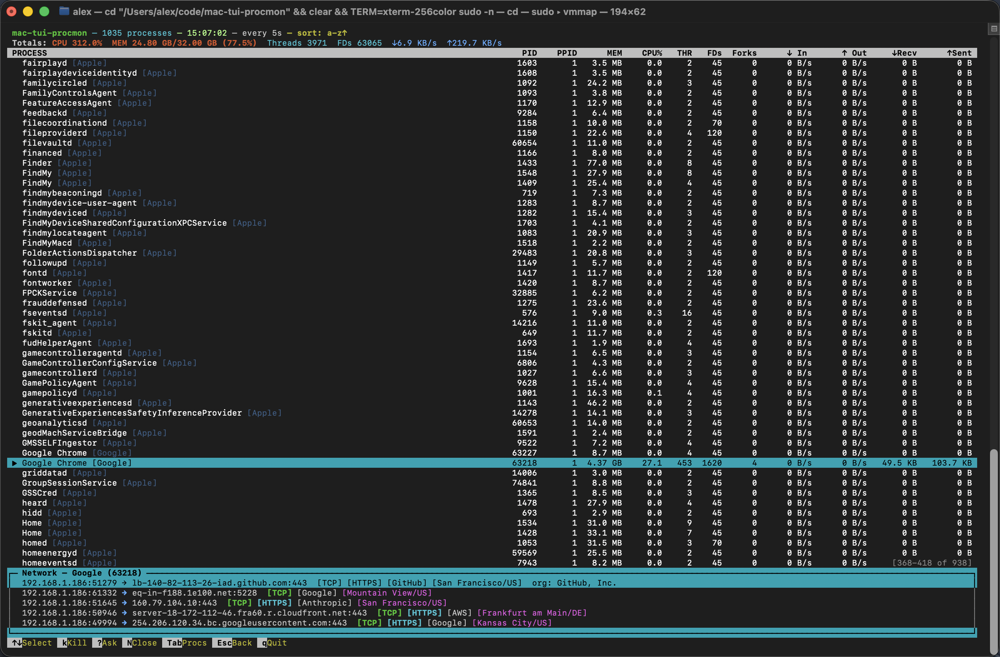
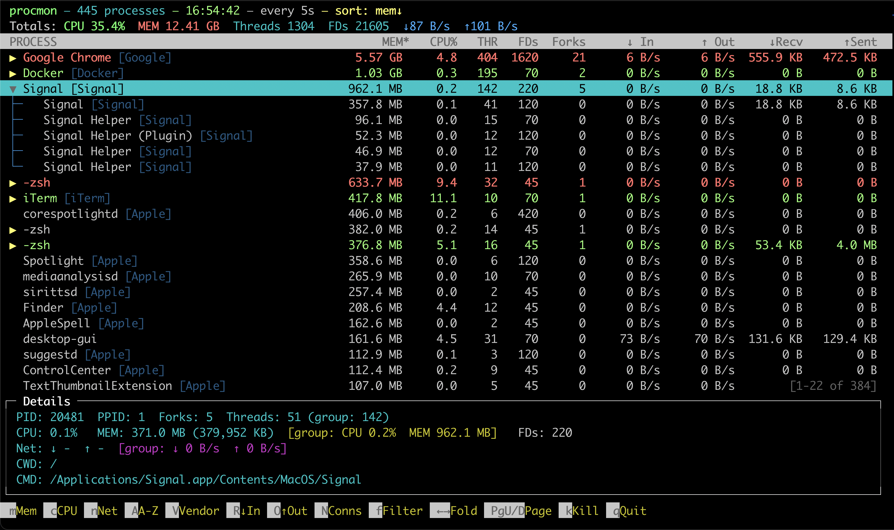
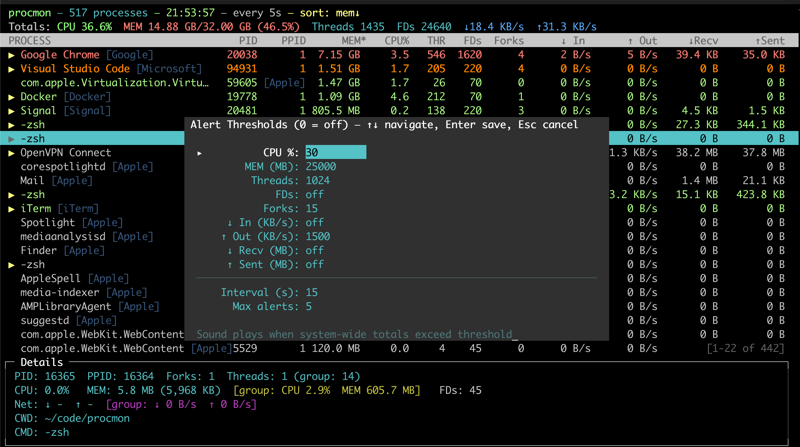

# procmon

A resilient, real-time process monitor for macOS with tree view, network tracking, and color-coded resource alerts. Single-file, zero dependencies.

## Screenshots

### General View
Process list sorted by memory with detail panel showing PID, CPU, memory, threads, FDs, network rates, and the full command path.


### Network View
Per-process network connections with protocol, service, organization, GeoIP location, and per-flow byte counters. Full org name shown for the selected connection.



### Process Group View
Expanded process tree showing parent and child processes with aggregated stats across the group.



### Alert Configuration
System-wide alert thresholds with configurable repeat interval and max alert count. Settings persist to `~/.procmon.json`.



## Features

- **Process Tree View** - Hierarchical parent-child display with collapsible nodes, aggregated stats across subtrees (CPU, memory, threads, FDs, forks, network)
- **Sibling Grouping** - Child processes with the same name are automatically grouped into a collapsible parent node with combined stats. Group header shows the member count (e.g. `Google Chrome Helper (Renderer) [Google] (16)`)
- **Vendor Grouping** - Press `g` to group all processes by vendor (Apple, Google, Microsoft, etc.) at the top level. Detects vendors from path prefixes and reverse-DNS names (e.g. `com.apple.weather.menu`)
- **Dynamic Sort** - Press `d` to pin threshold-exceeding processes to the top, with the active sort mode as secondary ordering within each group
- **9 Sort Modes** - Memory, CPU, Network rate, Bytes In, Bytes Out, Vendor, Alphabetical, Dynamic, Vendor Group. Press the same key twice to reverse direction
- **Network Connections** - Per-process connection list via `lsof` with per-flow byte tracking via `nettop`
- **GeoIP & Org Lookup** - Remote IPs show city/country and abbreviated organization (e.g. `[AWS]`, `[Anthropic]`). Full org name shown on selected connection
- **Per-Cell Threshold Coloring** - Individual metric columns (CPU, MEM, THR, FDs, etc.) turn red when they exceed their configured threshold, yellow at 80%. Only the specific metric is highlighted, not the entire row
- **Sound Alerts** - Configurable system-wide threshold alerts with sound notifications. Set CPU, memory, threads, FDs, forks, and network thresholds. Configurable repeat interval and max alert count. Counter only resets after a sustained period below threshold (one full interval), preventing infinite alerts from oscillating values
- **Process Filtering** - Include and exclude filters (comma-separated). Combine both to narrow results
- **File Descriptor Tracking** - Per-process and aggregated FD counts (can be disabled with `--no-fd` for speed)
- **Kill Support** - Kill a process subtree or a specific network connection's owning process
- **Persistent Config** - Alert thresholds and settings saved to `~/.procmon.json`, loaded automatically on startup
- **Resilient Design** - Locks its own memory and boosts priority so it keeps running during fork bombs or memory exhaustion. Avoids `fork()`/`exec()` by using ctypes directly

## Platform

macOS only. Uses native `libproc.dylib` and `libc.dylib` via ctypes for process enumeration without spawning subprocesses.

**System tools used:** `lsof` (network connections), `nettop` (per-flow byte counters)

## Requirements

- Python 3
- No external dependencies (stdlib only)

## Usage

```
procmon [name] [-i SECONDS] [--no-fd]
```

| Argument | Description |
|----------|-------------|
| `name` | Optional process name filter (case-insensitive substring match) |
| `-i`, `--interval` | Refresh interval in seconds (default: 5) |
| `--no-fd` | Skip file descriptor counting for faster updates |

**Examples:**

```bash
procmon                    # Monitor all processes
procmon firefox -i 2       # Monitor Firefox, refresh every 2 seconds
procmon --no-fd            # All processes, no FD tracking
```

## Configuration

Press `C` to open the alert thresholds dialog. Settings are saved to `~/.procmon.json` and persist across sessions.

| Setting | Description |
|---------|-------------|
| CPU % | System-wide CPU usage threshold |
| MEM (MB) | System-wide memory threshold in MB |
| Threads | Total thread count threshold |
| FDs | Total file descriptor threshold |
| Forks | Total fork count threshold |
| In/Out (KB/s) | Network rate thresholds |
| Recv/Sent (MB) | Cumulative network byte thresholds |
| Interval (s) | Seconds between repeated alerts (default: 60) |
| Max alerts | Maximum alert sounds before stopping (0 = unlimited, default: 5) |

Alert counter resets only after values stay below threshold for a full interval (prevents infinite alerts from oscillating values).

## Keybindings

### Process List

| Key | Action |
|-----|--------|
| `m` | Sort by memory |
| `c` | Sort by CPU |
| `n` | Sort by network rate |
| `A` | Sort alphabetically |
| `V` | Sort by vendor |
| `R` | Sort by bytes received |
| `O` | Sort by bytes sent |
| `d` | Toggle dynamic sort (threshold-exceeding processes first) |
| `g` | Toggle vendor grouping |
| `N` | Open network connections for selected process |
| `f` | Filter processes |
| `C` | Open alert threshold configuration |
| `Left/Right` | Collapse / expand tree node |
| `PgUp/PgDn` | Page navigation |
| `k` | Kill selected process subtree |
| `q` | Quit |

### Network View

| Key | Action |
|-----|--------|
| `Up/Down` | Select connection |
| `k` | Kill process owning selected connection |
| `N` | Close network view |
| `Tab` | Toggle focus between process list and connections |
| `Esc` | Back |

### Filter Prompt

| Key | Action |
|-----|--------|
| `Enter` | Apply filter |
| `Esc` | Cancel |
| `Ctrl-A` / `Home` | Jump to start |
| `Ctrl-E` / `End` | Jump to end |
| `Ctrl-U` | Clear line |
